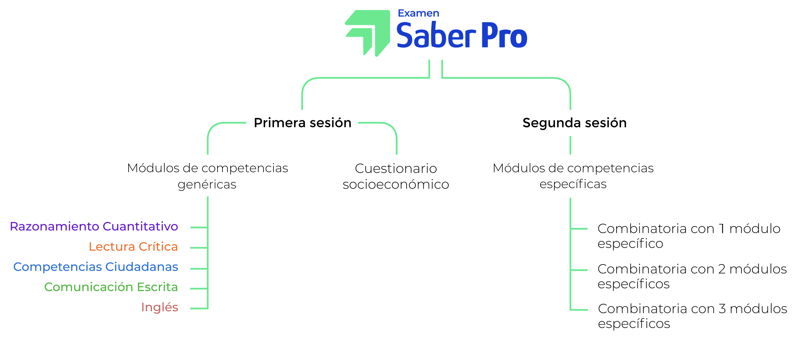

```{r setup, include=FALSE}
options(htmltools.dir.version = FALSE)
library(knitr)
library(pacman)
knitr::opts_chunk$set(warning = FALSE, message = FALSE)
# options(knitr.table.format = "html")
library(tidyverse)
library(babynames)
library(fontawesome) # from github: https://github.com/rstudio/fontawesome
p_load(ggplot2, gridExtra, ggthemes, latex2exp, dplyr, broom, knitr, leaflet, magrittr, viridis)
# Colors
red_pink <- "#e64173"
turquoise <- "#20B2AA"
grey_light <- "grey70"
grey_mid <- "grey50"
grey_dark <- "grey20"
# Themes
theme_axes_y <- theme_void() + theme(
  text = element_text(family = "sans"),
  axis.title = element_text(size = 11),
  plot.title = element_text(size = 11, hjust = 0.5),
  axis.title.x = element_text(hjust = .95, margin = margin(0.15, 0, 0, 0, unit = "lines")),
  axis.title.y = element_text(vjust = .95, margin = margin(0, -0.2, 0, 0, unit = "lines")),
  axis.text.y = element_text(
    size = 10, angle = 0, hjust = 0.9, vjust = 0.5,
    margin = margin(0, 0.4, 0, 0, unit = "lines")
  ),
  axis.line = element_line(
    color = grey_light,
    size = 0.25,
    arrow = arrow(angle = 30, length = unit(0.07, "inches")
  )),
  plot.margin = structure(c(1, 0, 1, 0), unit = "lines", valid.unit = 3L, class = "unit"),
  legend.position = "none"
)
theme_axes_x <- theme_void() + theme(
  text = element_text(family = "sans"),
  axis.title = element_text(size = 11),
  plot.title = element_text(size = 11, hjust = 0.5),
  axis.title.x = element_text(hjust = .95, margin = margin(0.15, 0, 0, 0, unit = "lines")),
  axis.title.y = element_text(vjust = .95, margin = margin(0, -0.2, 0, 0, unit = "lines")),
  axis.text.x = element_text(
    size = 10, angle = 0, hjust = 0.9, vjust = 0.5,
    margin = margin(0, 0.4, 0, 0, unit = "lines")
  ),
  axis.line = element_line(
    color = grey_light,
    size = 0.25,
    arrow = arrow(angle = 30, length = unit(0.07, "inches")
  )),
  plot.margin = structure(c(1, 0, 1, 0), unit = "lines", valid.unit = 3L, class = "unit"),
  legend.position = "none"
)
theme_set(theme_gray(base_size = 11))
# Knitr options
opts_chunk$set(
  comment = "#>",
  fig.align = "center",
  warning = F,
  message = F
)
```

layout: true
  
<div class="my-footer"><span>Uninorte | Departamento de Economía | Carlos A. Yanes</span></div>

<!-- this adds the link footer to all slides, depends on my-footer class in css-->

---
name: xaringan-title
class: left, middle, inverse
background-image: url(img/user2.jpeg)
background-size: cover

# Pruebas Saber Pro


### .fancy[Modulo Econometría]

.large[Carlos Yanes | Departamento de Economía | `r Sys.Date()`]

---
class: middle, inverse

.left-column[

# `r emo::ji("confused")`

]

.right-column[
# Y ahora que...??
]

---
name: point1
class: middle, inverse

# Saben lo que <br> .fat[.fancy[Enfrentan?]]

---
name: ninja
class: middle, inverse

# Yo asumo que:

--

### <i class="fab fa-youtube" style="float:left"/></i>&nbsp; Ya es lo suficientemente maduro(a)

--

### &nbsp; Le gustan los retos

--

### <i class="fab fa-html5 fa-lg fa-fw" style="float:left"></i>&nbsp; .saltinline[.fancy[Recuerda algo de Econometría]] 

---
class: middle, center
background-image: url(https://media.giphy.com/media/sZRjUjcBFit6U/giphy.gif)
background-size: cover

---
name: another
class: middle, inverse

# Llegó la hora <br> .fat[.fancy[De la verdad!!]]

---
# Mecanismo icfes

--




---
# Mecanismo icfes

--

`r fa("sketch", fill="blue")` .fancy[.acid[Comunicación Escrita]] Este módulo evalúa la competencia para *comunicar ideas por escrito* referidas a un tema dado. Específicamente, el estudiante debe **producir** un texto argumentativo en el que justifique su respuesta al problema planteado en el enunciado de la pregunta.

--

`r fa("sketch", fill="blue")` .fancy[.acid[Lectura crítica]] Este módulo evalúa tres competencias. Las dos primeras se refieren a la **comprensión del contenido de un texto**, ya sea a nivel local o global, y la tercera, a la aproximación propiamente **crítica** frente al texto.

--

`r fa("sketch", fill="blue")` .fancy[.acid[Razonamiento cuantitativo]] Este módulo evalúa el conjunto de **elementos de las matemáticas** (sean estos conocimientos o competencias) que permiten a un ciudadano tomar parte activa e informada en el contexto social, cultural, político, administrativo, económico, educativo y laboral. 

---
# Mecanismo icfes

--

`r fa("sketch", fill="blue")` .fancy[.acid[Competencias ciudadanas]] En este módulo se evalúan aquellas **habilidades cognitivas, emocionales y comunicativas** que, integradas entre sí y relacionadas con conocimientos y actitudes, hacen posible que el ciudadano actúe de manera *constructiva* en la sociedad.

--

`r fa("sketch", fill="blue")` .fancy[.acid[Inglés]]: Este módulo evalúa la competencia para **comunicarse efectivamente** en inglés en un nivel básico.

--

`r fa("sketch", fill="blue")` .fancy[.acid[Economía]]: Un módulo especifico y que contiene preguntas de *Macroeconomía*, *Microeconomía*, *Econometría*, *Estadística* e incluso *Pensamiento e historia económica* son mas o menos 50 preguntas de `opción múltiple` con `única` respuesta. 

--

`r fa("sketch", fill="blue")` Cada modulo contiene alrededor de 35 preguntas por componente siendo el de **ingles** quien mas tiene con mas o menos 55. Tambien hay preguntas generales para conocer de usted mismo/a. Los verbos mas importantes son **identifica** y **comprende**.


---
# Mecanismo icfes

--

Son .fat[3 habilidades] que se evaluan:

--

1. Comprende conceptos económicos asociados a un fenómeno económico.

--

2. Comprende las teorías económicas que permiten explicar un fenómeno económico.

--

3. Comprende las diferentes herramientas cuantitativas que permiten el planteamiento de un problema económico y su **solución**.


---
name: another
class: middle, inverse

# Hora  <br> .acid[.fancy[de Trabajar!!]]

---
.fat[.fancy[Pregunta 1]]

--

`r fa("laptop", fill="red")` Un par de firmas desean ver si un grupo de variables como `precio de la competencia` y el `ingreso de los hogares` impactan o tienen efecto en las ventas que regularmente tienen en sus operaciones diarias. La manera correcta de hacerlo es estableciendo un modelo restringido y otro que no contenga estas restricciones, lo que se conoce como la prueba F. Lo mas adecuado, para el caso de medir si son o no importantes es hacer uso de cierta hipótesis para eso. Le preguntan, cuál -para este caso- se adaptaría a esta situación?

--

A. $H_0:\beta_i= \beta_j= 0$ vs $H_1:\text{al menos un }\beta_i\neq 0$

B. $H_0:\beta_i\neq \beta_j\neq 0$ vs $H_1:\beta_i=\beta_j= 0$

C. $H_0:$ Modelo restringido es mejor vs $H_1:$ Modelo no restringido es mejor

D. $H_0:$ Las variables no tienen efecto vs $H_1:$ las variables tienen un efecto positivo

--

`r fa("check", fill="green")` CLAVE .fat[A]

---
.fat[.fancy[Pregunta 2]]

--

`r fa("laptop", fill="red")` Sea un proceso AR(1) de una serie de tiempo de cierta variable $Y_t=0.5Y_{t-1}+\epsilon_t$, donde $\epsilon_{t}$ que es el residuo o error sigue un proceso ruido blanco $\epsilon_t \sim (0,\sigma^{2}_e)$. La varianza de la variable $Y_t$ puede ser establecida como:

--

A. $2\sigma^2$

B. $\frac{4\sigma^2}{3}$

C. $\frac{\sigma^4}{2}$

D. $\frac{0.25}{\sigma^2}$

--

`r fa("check", fill="green")` CLAVE .fat[B]

---
.fat[.fancy[Pregunta 3]]

--

`r fa("laptop", fill="red")` Sea un proceso AR(1) de una serie de tiempo de cierta variable $Y_t=2+0.3Y_{t-1}+\epsilon_t$, donde $\epsilon_{t}$ que es el residuo o error sigue un proceso ruido blanco $\epsilon_t \sim (0,\sigma^{2}_e)$. La media $E(Y_t)$ de la serie de tiempo puede ser establecida como:

--

A. $E(Y)=2$

B. $E(Y)=\frac{1}{(1-\phi)}$

C. $E(Y)=\frac{4}{(1+\phi)}$

D. $E(Y)=\frac{2}{0.7}$

--

`r fa("check", fill="green")` CLAVE .fat[D]

---
.fat[.fancy[Pregunta 4]]

--

`r fa("laptop", fill="red")` Digamos que en Colombia se ha establecido un modelo de consumo agregado siguiendo las estipulaciones del modelo propuesto por Friedman tal que $C_t=\beta_1+\beta_2X_t+u_t$. Donde $C_t$ es el consumo agregado en un periodo especifico, $X_t$ no es observable directamente pero hace referencia al PIB a precios constantes y en dolares. Pero se asume una hipótesis de expectativas adaptativas que simplificando viene a ser $C_t=\alpha_1+\alpha_2X_t+\alpha_{3}C_{t-1} +v_t$. La estimación arroja los siguientes parámetros:

$$\begin{aligned}
\widehat{C}_t=&1.456+0.4043X_t+0.5207C_{t-1}\\
\text{s.e}\;=&\; (1.012)\quad \; \; \; (2.821) \quad \; \; \; (2.1743)
\end{aligned}$$
De acuerdo a lo anterior podemos de forma general concluir que:

--

A. Los parámetros $\alpha_2$ y $\alpha_3$ son significativos al 95% de nivel de confianza.

B. El modelo establecido esta incorrectamente especificado y hay que revisar la teoría propuesta.

C. En este caso los parámetros obtenidos $\alpha_i$ no son estadisticamente significativos al nivel de confianza del 95%. 

D. El residuo del modelo esta altamente correlacionado con los predictores establecidos en esta parte. 

--

`r fa("check", fill="green")` CLAVE .fat[C]

---
.fat[.fancy[Pregunta 5]]

--

`r fa("laptop", fill="red")` El gobierno Colombiano ha contratado a un grupo de economistas adscritos al ministerio de salud y quieren mirar si el gasto en salud depende de ciertas variables como el `ingreso` y el `stress` del individuo. Establecen un modelo teórico de tal manera que:

$$Ln(Salud)_i=\beta_0+\beta_1ingresos_i+\beta_2stress_i+u_i$$
Digamos que el estimador $\widehat{\beta}_2=0.17$. Una interpretación adecuada corresponde a:

--

A. En la medida que el stress de la persona aumenta su disponibilidad a gastar en salud  aumenta en un 17% manteniendo el resto de variables constantes.

B. En la medida que la salud del paciente se deteriora tiene una probabilidad de un 0.17% de hacer un mayor gasto en salud.

C. Si el ingreso es cero, los individuos tienen una disponibilidad a gastar en salud de un 0.17%.

D. En la medida que el stress de la persona aumenta manteniendo al ingreso constante su disponibilidad a gastar en salud aumenta en un 0.17%. 

--

`r fa("check", fill="green")` CLAVE .fat[A]

---
.fat[.fancy[Pregunta 6]]

--

`r fa("laptop", fill="red")` Un modelo de tasa de desempleo para colombia ha sido estipulado como:

$$\begin{aligned}
T\widehat{D}_t=&\;2,743+1,181D_t-1,427V_{t}-0,812(D_tV_t)\\
\text{t}\;=&\; (29.192)\;(3.198)\; \; \;\; (2.1743)\; \; \; \; \;(-1.9843)\\
R^2=&\;0.94
\end{aligned}$$
Donde: TD = tasa de desempleo en %, V = tasa de trabajo vacante en %, D = 1, para el período que comienza el cuarto trimestre de 2019; D = 0, para el período anterior al cuarto trimestre de 2019, t = tiempo, medido en trimestres.

¿Cuáles son las expectativas a priori respecto a la relación entre las tasas de desempleo y vacantes?

--

A. Si es estadísticamente distinta del período anterior al cuarto trimestre de 2019 debido a que la tasa de desempleo diferencial entre la categoría base y el período que comienza el cuarto trimestre de 2019 es de 1.18%.

B. La relación que existe entre las tasas de desempleo y vacantes es inversa, es decir, si se da un incremento porcentual del 1% en la tasa de vacante se estima que la tasa de desempleo disminuirá en 1.4%.

C. Si el ingreso es cero, los individuos tienen derecho a un subsidio del 15% entendiendose que existe una relación directa entre ambas variables y el gobierno intecede por éstos.

D. En la medida que las vacantes aumentan de forma constante de un 1.4% se puede deducir que todos los trimestres absorben el efecto producido por las vacantes en la economía.

---
name: buter
class: middle, inverse

# `r fa("check", fill="green")` CLAVE .fancy[B]

---
.fat[.fancy[Pregunta 7]]

--

`r fa("laptop", fill="red")` La siguiente figura muestra la distribución del estimador $\beta_1$: A, B, C y D con media de 20.

```{R, eval = T, echo = F, dev = "svg", fig.height = 4.5, message = F, warning = F}

# Colors
red_pink <- "#e64173"
turquoise <- "#20B2AA"
grey_light <- "grey70"
grey_mid <- "grey50"
grey_dark <- "grey20"

# Tres distribuciones
ggplot(data = tibble(x = c(-5, 45)), aes(x)) +
stat_function(
  fun = dchisq, args = list(df = 2.5), n = 1e4,
  geom = "area", fill = "grey10", color = "black", alpha = 0.4, size = 0.3
) +
stat_function(
  fun = dnorm, args = list(mean = 20, sd = 3), n = 5e3,
  geom = "area", fill = "grey50", color = "black", alpha = 0.3, size = 0.3
) +
stat_function(
  fun = dnorm, args = list(mean = 20, sd = 7), n = 5e3,
  geom = "area", fill = "grey70", color = "black", alpha = 0.3, size = 0.3
) +
stat_function(
  fun = dnorm, args = list(mean = 25, sd = 8), n = 5e3,
  geom = "area", fill = "grey10", color = "black", alpha = 0.3, size = 0.3
) +
geom_vline(xintercept = 20, linetype = "dotted", alpha = 0.5) +
annotate(geom = "text", x = 20, y = -0.015, label = TeX("$\\beta_{1}$"), hjust = 0.5, size = 5) +
annotate(geom = "text", x = 2.75, y = 0.2, label = "A") +
annotate(geom = "text", x = 16.8, y = 0.1, label = "B") +
annotate(geom = "text", x = 32, y = 0.02, label = "C") +
annotate(geom = "text", x = 40, y = 0.03, label = "D") +
theme_void()
```


---
.fat[.fancy[Pregunta 7]]

--

Cuál de los estimadores, si así ocurre, viene a ser insesgado?

--

A. El estimador $B$ claramente, aparte es mas eficiente y consistente.

B. Para este caso el estimador $A$ cumple con la eficiencia como logramos denotar en el gráfico propuesto.

C. El estimador $C$ puesto que $E(Y|X)=20$ y este cumple con las condiciones establecidas.

D. Aunque no tiene mínima varianza el estimador $D$ posee la característica de ser un estimador insesgado.

--

`r fa("check", fill="green")` CLAVE .fat[A]

---
.fat[.fancy[Pregunta 8]]

--

`r fa("laptop", fill="red")` Observe la siguiente distribución de los distintos errores/residuos de un conjunto de modelos que se han estimado.

```{R, echo = F, dev = "svg", fig.height = 4.5}
set.seed(123456)
n <- 115
# No 
p1 <- ggplot(data = tibble(x = 1:n, u = rnorm(n)), aes(x = x, y = u)) +
geom_hline(yintercept = 0) +
scale_y_continuous(breaks = 0) +
geom_point() +
ggtitle("Modelo A") +
theme_axes_y
# Homocedasticas
p2 <- ggplot(data = tibble(x = 1:n, u = rnorm(n, sd = abs(sin(x/(100))) + 0.1)), aes(x = x, y = u)) +
geom_hline(yintercept = 0) +
scale_y_continuous(breaks = 0) +
geom_point() +
ggtitle("Modelo B") +
theme_axes_y
# Peor 1
p3 <- ggplot(data = tibble(x = 1:n, u = runif(n, min = -250, max = (x-50.5)^2)), aes(x = x, y = u)) +
geom_hline(yintercept = 0) +
scale_y_continuous(breaks = 0) +
geom_point() +
ggtitle("Modelo C") +
theme_axes_y

# ni se diga

# Peor
p4 <- ggplot(data = tibble(x = 1:n, u = runif(n, min = -230, max = (x-150.5)^2)), aes(x = x, y = u)) +
geom_hline(yintercept = 0) +
scale_y_continuous(breaks = 0) +
geom_point() +
ggtitle("Modelo D") +
theme_axes_y


# Graficamos todas
grid.arrange(p1, p2, p3, p4, nrow = 2)
```


---
.fat[.fancy[Pregunta 8]]

--

De estos resultados, quien no viola el supuesto de homocedasticidad?

--

A. El modelo $B$ los residuos son constantes y con menor dispersión.

B. Si logramos observar el modelo $A$ cumple con el supuesto de $var(u_i)=\sigma^2$.

C. El modelo $D$ puesto que $Var(Y)=1.7$ y este cumple con las condiciones establecidas.

D. Aunque no tiene mínima varianza el modelo $C$ posee la característica de ser ser invariante en el tiempo.

--

`r fa("check", fill="green")` CLAVE .fat[B]

---
.fat[.fancy[Pregunta 9]]

`r fa("laptop", fill="red")` Se ha planteado el siguiente modelo de una entidad privada para mirar si en alguna parte existe un grupo de variables que puedan determinar el gasto en salud


$$Salud_i=\beta_0+\beta_1ingresos_i+\beta_2edad_i+\beta_3educación_i+u_i$$
Qué tipo de datos debe tener para lograr estimar la anterior ecuación?

--

A. Datos de una base de corte transversal que permiten mirar en un tiempo determinado los efectos de cada variable por individuo.

B. Si la idea es mirar un grupo de individuos en varios momentos del tiempo entonces se debe mirar los datos longitudinales.

C. Un grupo de datos consecuentes en el tiempo, por ende una serie puede ser útil para esta parte.

D. Datos de corte repetido en distintos momentos del tiempo.

--

`r fa("check", fill="green")` CLAVE .fat[A]

---
.fat[.fancy[Pregunta 10]]

--

`r fa("laptop", fill="red")` Tenemos un modelo que nos indica:

$$Ingreso_i= \beta_0+\beta_1educación+\beta_2habilidad+u_i$$
Pero no podemos observar la variable *habilidad* y en lugar de eso se estima un modelo como:
$$ingreso_i= \beta_0+\beta_1educación+u_i$$
Qué condiciones son requeridas para decir que tenemos un problema de sesgo por omisión de variables y por ende el resultado de la educación presente sesgos.

--

A. La habilidad afecta al ingreso y se correlaciona con la educación.

B. La habilidad  se correlaciona con la educación pero no con el ingreso.

C. La habilidad no tiene relación con el ingreso y tampoco con la educación.

D. La habilidad afecta al ingreso pero no se correlaciona con la educación.

--

`r fa("check", fill="green")` CLAVE .fat[A]

---
.fat[.fancy[Pregunta 11]]

--

`r fa("laptop", fill="red")` Sea el siguiente gráfico de estimadores por Mínimos Cuadrados Ordinarios (MCO) y Mínimos Cuadrados Ponderados

```{r, bu01, dev = "svg", echo = F, fig.height = 5}
# Muestra y repeticiones
n <- 100      
reps <- 1e5

# choose epsilon and create a vector of weights as defined above
epsilon <- 0.8
w <- c(rep((1 + epsilon) / n, n / 2), 
       rep((1 - epsilon) / n, n / 2) )

# draw a random sample y_1,...,y_n from the standard normal distribution, 
# use both estimators 1e5 times and store the result in the vectors 'ols' and 
# 'weightedestimator'

ols <- rep(NA, reps)
weightedestimator <- rep(NA, reps)

for (i in 1:reps) {
  
  y <- rnorm(n)
  ols[i] <- mean(y)
  weightedestimator[i] <- crossprod(w, y)
  
}

# plot kernel density estimates of the estimators' distributions: 

# OLS
plot(density(ols), 
     col = "purple", 
     lwd = 2, 
     main = "Función de estimadores",
     xlab = "Estimador",
     ylab = "Densidad")

# weighted
lines(density(weightedestimator), 
      col = "steelblue", 
      lwd = 2) 

# add a dashed line at 0 and add a legend to the plot
abline(v = 0, lty = 2)

legend('topright', 
       c("MCO", "Ponderado"), 
       col = c("purple", "steelblue"), 
       lwd = 2)
```

---
.fat[.fancy[Pregunta 11]]

--

Podemos entonces concluir a partir de lo anterior que:

A. El estimador MCO es insesgado y MCP no lo es

B. El estimador MCP es mucho mas eficiente que el de MCO

C. El estimador MCO es mas eficiente que el de MCP

D. Ambos estimadores convergen en media 0 y varianza constante

--

`r fa("check", fill="green")` CLAVE .fat[C]

---
.fat[.fancy[Pregunta 12]]

--

`r fa("laptop", fill="red")` En el análisis de regresión, ¿cuál es la principal diferencia entre el estimador de Mínimos Cuadrados (MCO) y el estimador de Mínimos Cuadrados Ponderados (MCP)?

A. El MCO asigna pesos iguales a todos los puntos de datos, mientras que el MCP asigna pesos diferentes basados en la varianza de los residuos.

B. El MCO es más adecuado para datos no lineales, mientras que el MCP es preferible para modelos lineales.

C. El MCO siempre produce estimaciones más precisas que el MCP.

D. El MCO solo se utiliza para modelos con una única variable independiente, mientras que el MCP es aplicable a modelos con múltiples variables independientes.

--

`r fa("check", fill="green")` CLAVE .fat[A]

---
.fat[.fancy[Pregunta 13]]

--

`r fa("laptop", fill="red")` Sea la siguiente matriz de varianza de los errores de cierto modelo y que por ende nos dice que tipo de heterocedasticidad posee.

$$W = 
\begin{bmatrix}
    \frac{1}{{\hat{\sigma}_1}^2} & 0 & \dots & 0 \\
    0 & \frac{1}{{\hat{\sigma}_2}^2} & \dots & 0 \\
    \vdots & \vdots & \ddots & \vdots \\
    0 & 0 & \dots & \frac{1}{{\hat{\sigma}_n}^2}
\end{bmatrix}$$

Una forma de corregir es:

--

A. No haciendo nada de correcciones, el modelo es el correcto.

B. Aplicando a cada uno de los elementos el peso de $\sigma^3$.

C. Aplicando logaritmo a la serie original.

D. Aplicando mínimos cuadrados en dos etapas.

--

`r fa("check", fill="green")` CLAVE .fat[B]

---
.fat[.fancy[Pregunta 14]]

--

`r fa("laptop", fill="red")` Supongamos que un economista está investigando el efecto de la educación en los salarios de los trabajadores. Sin embargo, existe la preocupación de que la educación esté correlacionada con la habilidad innata de una persona, lo que podría sesgar las estimaciones. El economista decide utilizar una variable instrumental para abordar este problema. ¿Cuál de las siguientes afirmaciones describe mejor la función de la variable instrumental en este caso?

--

A. La variable instrumental se utiliza para ajustar las estimaciones de los coeficientes de regresión, mejorando la precisión de las estimaciones.

B. La variable instrumental se utiliza para introducir endogeneidad en el modelo de regresión, permitiendo analizar su efecto en las variables independientes.

C. La variable instrumental se utiliza para eliminar la multicolinealidad entre las variables independientes, asegurando que sean ortogonales entre sí.

D. La variable instrumental se utiliza para controlar la posible correlación entre la educación y la habilidad innata, permitiendo estimar el efecto causal de la educación en los salarios.

--

`r fa("check", fill="green")` CLAVE .fat[D]

---
.fat[.fancy[Pregunta 15]]

--

`r fa("laptop", fill="red")` Sea el siguiente gráfico de las distintas puntuaciones que ha obtenido una institución de puntos de acuerdo a las participaciones que han hecho.

```{r, bu02, dev = "svg", echo = F, fig.height = 5}
# Cargar la librería necesaria
library(ggplot2)

# Crear un dataframe con datos de ejemplo
data <- data.frame(
  Grupo = rep(c("Fútbol", "Baloncesto", "Tenis", "Natación", "Atletismo", "Esgrima"), each = 10),
  Puntuaciones = c(78, 85, 90, 72, 88, 80, 88, 92, 75, 83, 68, 73, 85, 92, 79, 87, 93, 88, 90, 95,
                   65, 72, 78, 82, 70, 68, 74, 80, 88, 82, 88, 95, 92, 89, 78, 85, 83, 77, 86, 90,
                   55, 62, 58, 52, 60, 58, 53, 65, 59, 62, 45, 50, 67, 74, 72, 68, 75, 69, 73, 70)
)

# Crear un gráfico de bigotes usando ggplot2
ggplot(data, aes(x = Grupo, y = Puntuaciones)) +
  geom_boxplot() +
  labs(title = "Puntuaciones de Clasificadores de Deportes",
       x = "Deporte",
       y = "Puntuaciones") +
  theme_minimal()

```

---
.fat[.fancy[Pregunta 15]]

--

Si evaluáramos el perfomance de cada uno de los deportes practicados en el colegio podemos entonces concluir que:

--

A. El colegio es bueno tanto en baloncesto como en natación.

B. En esgrima tiene los peores puntajes pero mejor rendimiento.

C. Natación es el deporte por excelencia de la institución

D. Es mejor que se dediquen al atletismo, hay oportunidad de mejora.

--

`r fa("check", fill="green")` CLAVE .fat[A]

---
class: inverse, middle, center

# The End

